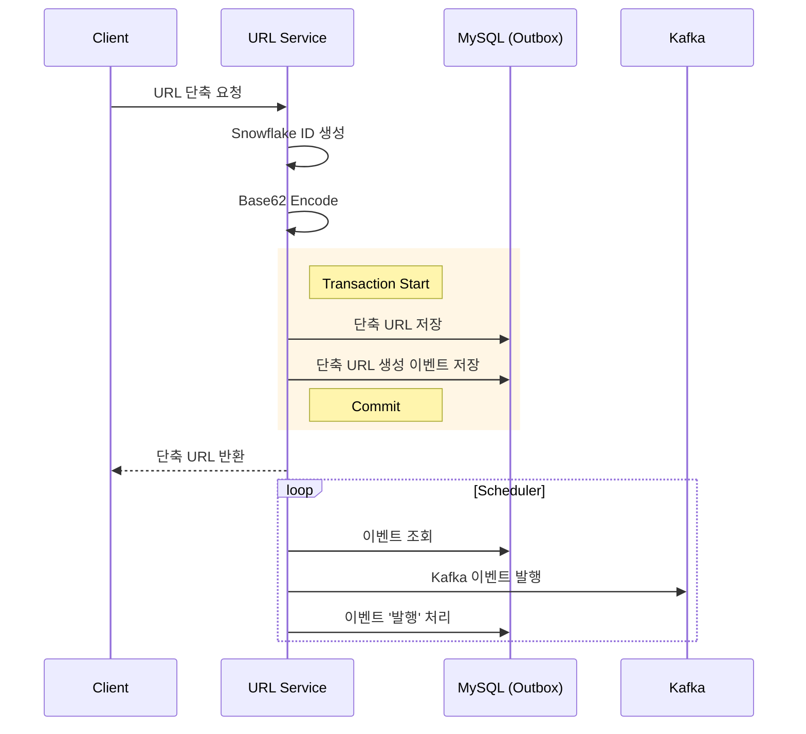
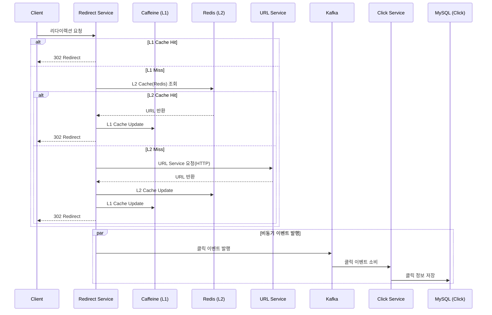

# Shortly - 고성능 URL 단축 서비스

## 기술 스택

### Backend
- **Java 21**
- **Spring Boot 3.5.6**
- **MySQL 8.0**
- **Redis 7.2** (Lettuce)

### Infrastructure

- **MQ**: Apache Kafka 3.5.1
- **Cache**: Caffeine(L1), Redis(L2)
- **Monitoring**: Prometheus, Grafana
- **Testing**: JUnit 5, k6

### 핵심 특징

- **MSA 아키텍처**: 3개의 독립적인 마이크로서비스
- **Event-Driven**: Apache Kafka 기반 비동기 통신
- **Multi-tier 캐싱**: Caffeine (L1) + Redis (L2)

## 아키텍처

### 시스템 아키텍처

### 워크플로우

#### 1. URL 단축

#### 2. URL 리다이렉션

## 문제 해결 경험

- [Snowflake Algorithm으로 URL 충돌률 1.3%→0%, 생성속도 3.2배 개선](docs/01_SNOWFLAKE_ALGORITHM.md)
- [Transactional Outbox Pattern으로 Kafka 장애 시 이벤트 유실 방지 (24만건 무손실)](docs/02_TRANSACTIONAL_OUTBOX_PATTERN.md)
- [2-Layer Cache (Redis+Caffeine) 전략으로 캐시 히트율 99.996%, P95 90ms 달성](docs/03_TWO_LAYER_CACHE_STRATEGY.md)
