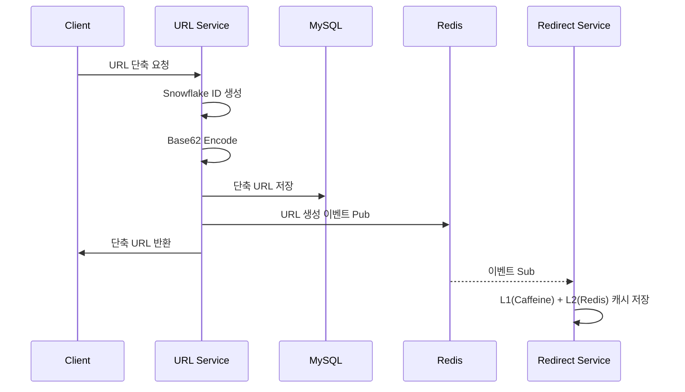
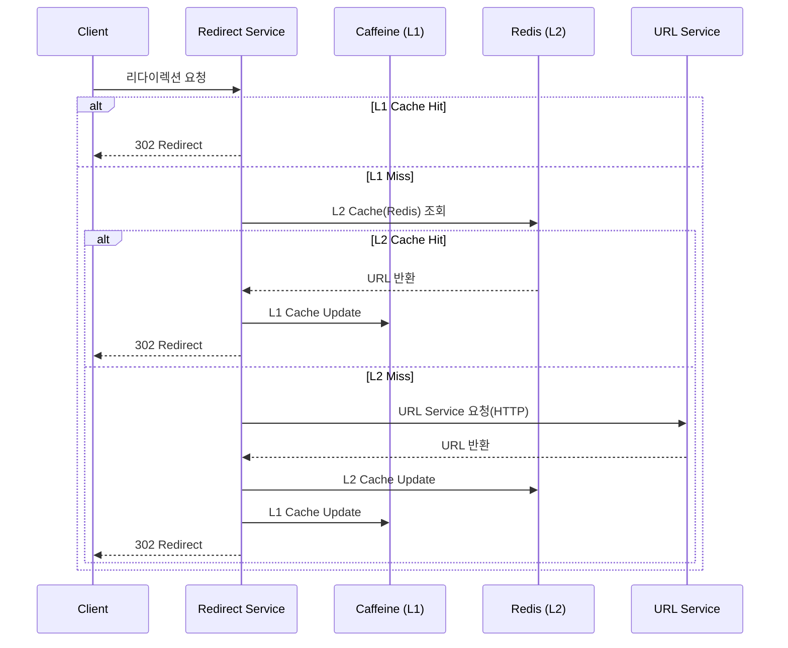

# Shortly - 고성능 URL 단축 서비스

## 1. 개요

### 1.1 기능 요구사항
- URL 단축
  - 사용자는 원본 URL을 입력하면 단축 URL을 생성할 수 있다.
  - 단축 URL은 중복이 발생하면 안 된다.
- 리다이렉트
  - 사용자가 단축 URL에 접속하면 원본 리다이렉트된다.
- 통계 기능
  - 단축 URL 별 클릭 기록 조회 가능

### 1.2 비기능 요구사항
- `가용성`: 서비스가 다운되면 모든 URL 리다이렉션이 실패하기 때문에 시스템은 높은 가용성을 가져야 한다.
- `성능`: URL 리다이렉션은 최소한의 Latency로 처리되어야 한다.
- `무작위성`: 단축된 URL은 추측이 예측 불가능하게 생성되어야 한다.

### 1.3 기술 스택
- Java 21
- Spring Boot 3.5.6
- MySQL 8.0
- Redis 7.2 (Lettuce)
- Kafka

## 2. 아키텍처

### 2.1 시스템 아키텍처

### 2.2 워크플로우

#### URL 단축

#### URL 리다이렉션

## 3. 문제 해결 경험

- [클릭 이벤트의 신뢰성을 보장하기 위한 Kafka 설정 최적화](docs/04_KAFKA_CLICK_EVENT.md)
- [k6 부하 테스트를 통한 성능 개선 과정](docs/06_LOAD_TEST.md)
- [단축 URL 특성을 고려한 캐시 만료 정책 선택(TinyLFU VS LFU VS LRU)](docs/02_CACHE_EVICTION.md)
- [Caffeine Cache 동기화 메커니즘을 활용한 Cache Stampede 문제 해결](docs/03_CACHE_STAMPEDE.md)
- [메세지 큐 선택 과정(RabbitMQ VS Kafka VS Redis)](docs/01_MQ_CHOICE.md)
- [Snowflake Algorithm으로 URL 충돌률 1.3% → 0%, 생성속도 3.2배 개선](docs/05_SNOWFLAKE_ALGORITHM.md)
