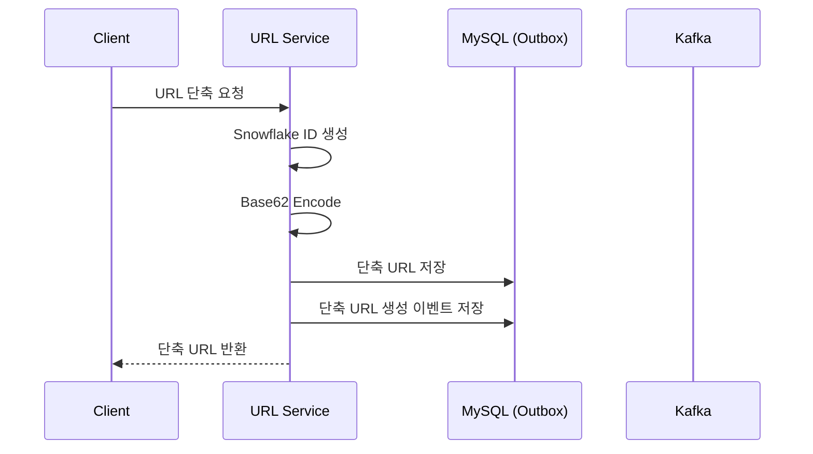
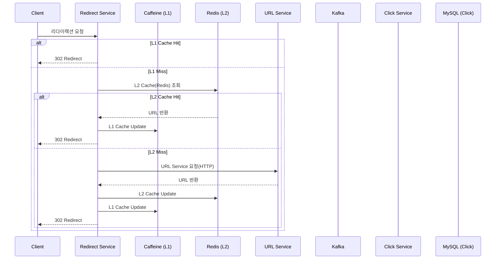

# Shortly - 고성능 URL 단축 서비스

## 기술 스택

### Backend
- **Java 21**
- **Spring Boot 3.5.6**
- **MySQL 8.0**
- **Redis 7.2** (Lettuce)

### Infrastructure

- **MQ**: Apache Kafka 3.5.1
- **Cache**: Caffeine(L1), Redis(L2)
- **Monitoring**: Prometheus, Grafana
- **Testing**: JUnit 5, k6

### 핵심 특징

- **MSA 아키텍처**: 3개의 독립적인 마이크로서비스
- **Event-Driven**: Apache Kafka 기반 비동기 통신
- **Multi-tier 캐싱**: Caffeine (L1) + Redis (L2)

## 아키텍처

### 시스템 아키텍처

### 워크플로우

#### 1. URL 단축

#### 2. URL 리다이렉션

## 문제 해결 경험

- [메세지 큐 선택 과정(RabbitMQ VS Kafka VS Redis)](docs/01_SNOWFLAKE_ALGORITHM.md)
- [단축 URL 특성을 고려한 캐시 만료 정책 선택(TinyLFU VS LFU VS LRU)](docs/02_CACHE_EVICTION.md)
- [Caffeine Cache 동기화 메커니즘을 활용한 Cache Stampede 문제 해결](docs/03_CACHE_STAMPEDE.md)
- [클릭 이벤트의 신뢰성을 보장하기 위한 Kafka 설정 최적화](docs/04_KAFKA_CLICK_EVENT.md)
- [Snowflake Algorithm으로 URL 충돌률 1.3% → 0%, 생성속도 3.2배 개선](docs/05_SNOWFLAKE_ALGORITHM.md)
- [k6 부하 테스트를 통한 성능 개선 과정](docs/06_LOAD_TEST.md)
