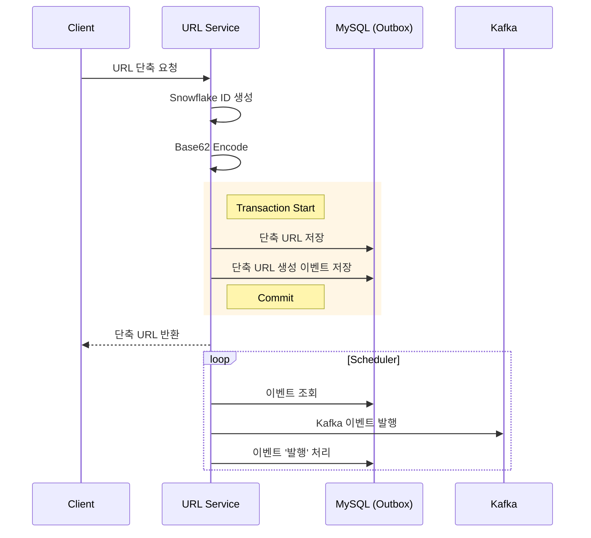
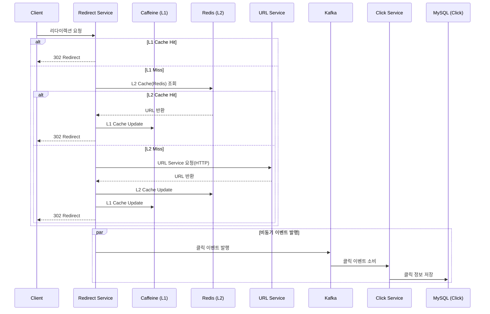

# Shortly - 고성능 URL 단축 서비스

## 기술 스택

### Backend
- **Java 21**
- **Spring Boot 3.5.6**
- **MySQL 8.0**
- **Redis 7.2** (Lettuce)

### Infrastructure
- **Message**: Apache Kafka 3.5.1
- **Cache**: Caffeine(L1), Redis(L2)
- **Monitoring**: Prometheus, Grafana
- **Testing**: JUnit 5, k6

### 핵심 특징

- **MSA 아키텍처**: 3개의 독립적인 마이크로서비스
- **Event-Driven**: Apache Kafka 기반 비동기 통신
- **Multi-tier 캐싱**: Caffeine (L1) + Redis (L2)

## 아키텍처

### 시스템 아키텍처

### 워크플로우

#### 1. URL 단축

#### 2. URL 리다이렉션

## 문제 해결 경험

### 1. Short Code 충돌 문제
`문제 상황`
- 초기에는 원본 URL에 `System.nanoTime()`을 더해 SHA-256 해싱 후 Base62로 인코딩하는 방식 사용
- 부하 테스트를 진행하면서 해시 충돌 빈도가 급격히 증가 -> 5만 건 요청 시 639건 충돌 발생

`개선 방안 및 시도 과정`

1. UUID
- 충돌 확률이 극히 적고 외부 의존성이 없음
- 128비트의 길이로 인해 URL이 길어지고, 짧게 만들면 중복 가능성이 높아짐
2. Redis Atomic Increment
- 구현이 간단하며 메모리 기반의 빠른 속도 보장
- SPOF -> Redis 장애 시 서비스 중단으로 이어짐
3. Snowflake Algorithm (선택)
- 전역 유일 ID 생성으로 충돌 확률이 0에 가까움
- 분산 환경에서 확장 가능하며, 중앙 서버가 필요 없음

`결과`
- 분산 환경에서 각 서버가 다른 WorkerID와 DatacenterID를 갖도록 Redis `SETNX` 명령어 활용
- 50만 건 기준 충돌 0건, 생성 속도 3.2배 개선(141ms → 44ms)
- 기존 Base62+SHA-256 방식은 5만 건 요청 시 639건 충돌 발생

### 2. Cache Stampede 문제
`문제 상황`
- 인기 URL 만료 시 다수의 동시 요청이 DB로 몰릴 수 있음

`개선 방안 및 시도 과정`

1. 분산 락
- 락을 획득한 단일 요청만 DB를 조회하고 나머지는 캐시 데이터를 대기
- 인기 URL의 경우 대기 상태 요청이 늘어남
2. Jitter (선택)
- TTL에 무작위 시간(Jitter)을 추가하여 만료 시점 분산
- Caffeine(L1) + Redis(L2) 조합으로 DB 부하 최소화

`결과`
- 초당 3,700건의 요청 발생 → 실패율 0%, 캐시 히트율 99.996% 달성 및 P95 90ms 이하 달성.

### 3. 데이터 정합성 보장 - Outbox Pattern
`문제 상황`
- DB 트랜잭션 커밋 후 Kafka 발행 실패 시 이벤트 유실로 인해 리다이렉트 실패

`개선 방안 및 시도 과정`

1. CDC
- 정합성은 보장되나, 별도 인프라(Debezium 등) 구축 및 운영 복잡도 높음
2. Transactional Outbox Pattern (선택)
- 단축 URL 저장과 이벤트 발행을 하나의 트랜잭션으로 묶고 별도 스케줄러로 이벤트 발행
- 원자성 보장 및 메시지 시스템 장애 격리

`결과`
- 부하 테스트로 24만 건 요청 중 브로커 강제 종료 → 재실행 후 미발행 이벤트 재발행 확인(유실 0건).
