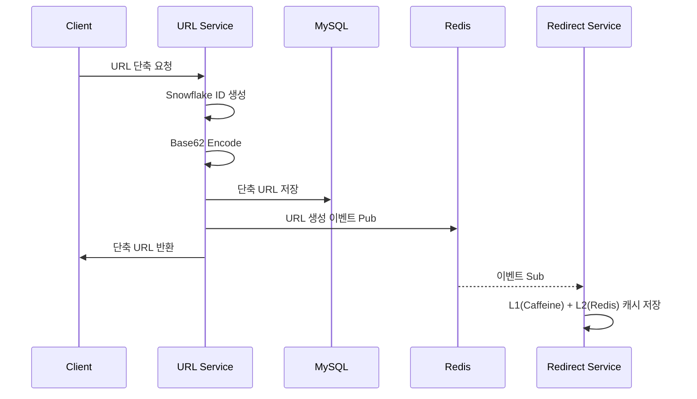
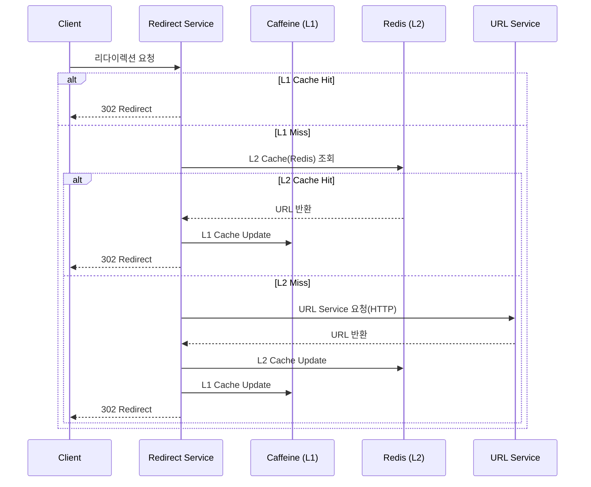

# Shortly - 고성능 URL 단축 서비스

## 1. 개요

Shortly는 Kafka와 Redis를 활용한 대규모 트래픽 처리에 최적화된 URL 단축 서비스입니다.

### 1.1 주요 성과

- `TPS`: 13,622/s
- `P95`: 67.84ms
- `캐시 히트율`: 91.8% (L1 Caffeine + L2 Redis 멀티 레이어)
- `데이터 유실 0건`: Kafka At-Least-Once + 멱등성

### 1.2 기능 요구사항

- URL 단축
  - 사용자는 원본 URL을 입력하면 단축 URL을 생성할 수 있다.
  - 단축 URL은 중복이 발생하면 안 된다.
- 리다이렉트
  - 사용자가 단축 URL에 접속하면 원본 리다이렉트된다.
- 통계 기능
  - 단축 URL 별 클릭 기록 조회 가능

### 1.3 비기능 요구사항

- `가용성`: 서비스가 다운되면 모든 URL 리다이렉션이 실패하기 때문에 시스템은 높은 가용성을 가져야 한다.
- `성능`: URL 리다이렉션은 최소한의 Latency로 처리되어야 한다.
- `무작위성`: 단축된 URL은 추측이 예측 불가능하게 생성되어야 한다.

### 1.4 기술 스택

- **Java 21**
- **Spring Boot 3.5.6**
- **Kafka**
- **Redis**
- **Caffeine**
- **MySQL 8.0**

## 2. 아키텍처

### 2.1 시스템 아키텍처

### 2.2 워크플로우

#### URL 단축

#### URL 리다이렉션

## 3. 핵심 기술

### 3.1 Kafka를 활용한 신뢰성 보장

**문제:** 클릭 이벤트는 과금 데이터로, 유실 시 매출 손실 발생

**해결:**

- At-Least-Once 전달 보장 (`acks=all` + `enable.idempotence`)
- Consumer DLQ로 영구 실패 메시지 보존
- 멱등성 처리로 중복 제거 (Snowflake ID + DB Unique Constraint)

**성과:** 130만 개 이벤트 발행 -> 유실 0건

[상세 보기: Kafka 설정 최적화](docs/04_KAFKA_CLICK_EVENT.md)

---

### 3.2 Redis 멀티 레이어 캐싱

**문제:** Read-Heavy 트래픽 (읽기:쓰기 = 100:1)에서 DB 부하 최소화 필요

**해결:**

- **L1 (Caffeine)**: W-TinyLFU 정책으로 인기 데이터 보호 (LRU 대비 30% 히트율 향상)
- **L2 (Redis)**: LFU 정책으로 인기 URL 장기 보존
- **Pub/Sub**: 캐시 워밍
- **Cache Stampede 방지**: LoadingCache + refreshAfterWrite

#### 성과: 캐시 히트율 91.8%, DB 부하 최소화

상세 보기:
- [캐시 전략](docs/02_CACHE_EVICTION.md)
- [캐시 스탬피드 해결](docs/03_CACHE_STAMPEDE.md)

---

### 3.3 성능 최적화

**개선 과정:**

| 단계       | 병목           | 해결책                        | TPS           | P95         |
|----------|--------------|----------------------------|---------------|-------------|
| Baseline | -            | -                          | 7,365         | 133ms       |
| 1차 개선    | Tomcat 연결 제한 | `max-connections` 1,500 증가 | 10,505 (+42%) | 141ms       |
| 2차 개선    | Kafka 발행 블로킹 | Virtual Thread Executor 분리 | 13,622 (+85%) | 67ms (-49%) |

#### 최종 성과: TPS 85% 향상, P95 49% 개선

[상세 보기: 부하 테스트](docs/06_LOAD_TEST.md)

---

## 4. 상세 문서
- [TPS 85% 향상, P95 49% 개선 - k6 부하 테스트 과정](docs/06_LOAD_TEST.md)
- [Cache Stampede 해결 - 캐시 히트율 91.8% 달성](docs/03_CACHE_STAMPEDE.md)
- [캐시 정책 선택 - W-TinyLFU vs LFU vs LRU](docs/02_CACHE_EVICTION.md)
- [클릭 이벤트의 신뢰성을 보장하기 위한 Kafka 설정 최적화](docs/04_KAFKA_CLICK_EVENT.md)
- [이벤트별 MQ 선택 - Redis Pub/Sub vs Kafka](docs/01_MQ_CHOICE.md)
- [Snowflake Algorithm으로 URL 충돌률 1.3% → 0%, 생성속도 3.2배 개선](docs/05_SNOWFLAKE_ALGORITHM.md)
