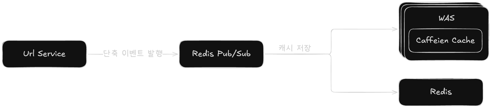
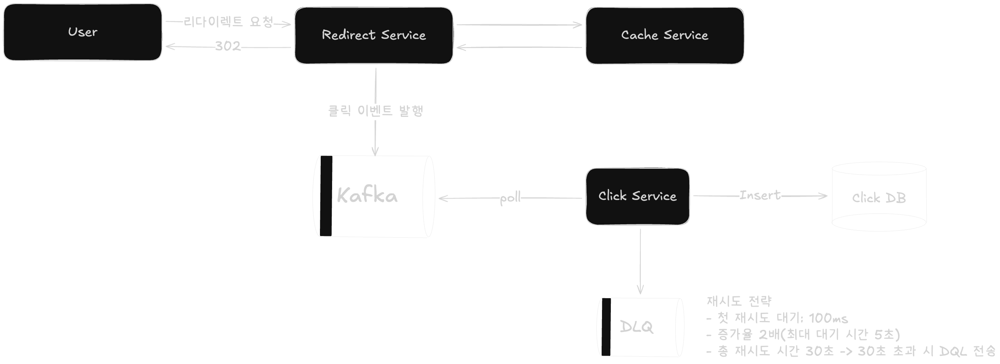

## 1. 이벤트 특성

### 1.1 URL 단축 이벤트
- 단축 URL 정보를 L1(Caffeine), L2(Redis) 캐시에 적재하여 조회 성능 향상이 목표(캐시 워밍)
- 이벤트 유실 시에도 Caffeine CacheLoader가 하나의 요청만 DB로 전달
  - 이벤트 유실이 서비스 장애로 이어지지 않음
- 트래픽: 1,000 TPS 이하

### 1.2 리다이렉션 이벤트
- 사용자의 클릭 정보를 DB에 저장하여 비즈니스에 활용한다는 가정(ex. 클릭당 요금 부과)
  - 유실을 허용하지 않음
  - `at-least-once` 모델 사용
- 재처리 가능해야 함
- 트래픽: 10,000 ~ 100,000 TPS

## 2. 기술 선택
### 2.1 URL 단축 이벤트: Redis Pub/Sub
#### 사유:
- URL 단축 이벤트는 유실되어도 서비스 장애가 발생하지 않는 구조
- 이벤트 목적이 캐시 워밍이므로 Latency가 낮고 즉시 처리되는 것이 중요
- Pub/Sub은 Redis 내부 네트워크에서 동작하여 가장 빠른 반응 속도 제공
- Redis Stream이나 Kafka는 오버엔지니어링이라고 판단

#### 이벤트 처리 흐름

### 2.2 리다이렉션 이벤트: Kafka
#### 사유:
- 트래픽이 1~10만 TPS로 고처리량 메시지 큐가 필요하다고 판단
- 유실되면 안 되는 비즈니스 데이터
- Offset 기반으로 메시지를 보관하여, 장애 복구나 버그 수정 후 재처리 가능

#### 이벤트 처리 흐름

