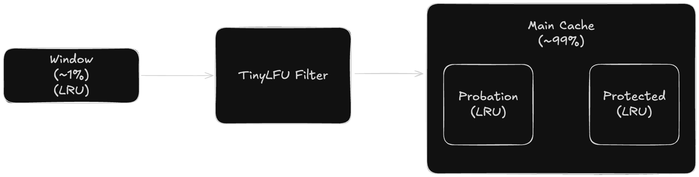
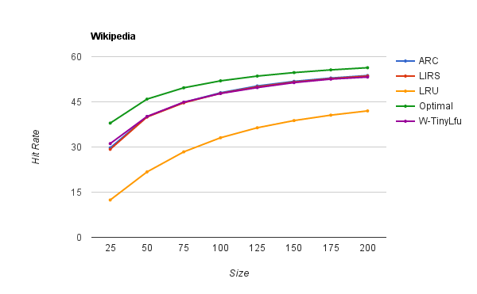

## 1. 단축 URL 특성

### 1.1 Read Heavy
- 단축 URL 서비스는 읽기 위주(Read-Heavy)
- 읽기 쓰기 비율을 `100:1`로 가정

### 1.2 불변 데이터
- 단축 URL은 한 번 생성되면 변경되지 않는 불변(Immutable) 데이터
- 매핑 관계가 영구적으로 유지 -> 데이터 갱신(refresh)이 불필요

### 1.3 트래픽 패턴
- 소수의 인기 URL이 전체 트래픽의 대부분을 차지
- 생성 초기 트래픽이 많고 점진적으로 감소

## 2. 캐시 Eviction 정책 비교

### 2.1 LRU (Least Recently Used)
- 가장 오래 전에 접근된 항목을 먼저 제거하는 정책
- 구현이 단순하며 최근 접근 데이터 유지에 유리
- 빈도를 고려하지 않아 인기 항목이 오래 접근 안 되면 제거될 수 있음

### 2.2 LFU (Least Frequently Used)
- 접근 빈도가 가장 낮은 항목을 먼저 제거하는 정책
- 접근 패턴을 반영하여 인기 항목 유지에 유리함
- 새로운 항목이 캐시에 머물기 어려워 과거 인기 항목이 현재 불필요해도 유지됨

### 2.3 W-TinyLFU (Window Tiny Least Frequently Used)
- LRU와 LFU의 장점을 결합한 하이브리드 정책
- 최근성(Recency)과 빈도(Frequency) 모두 고려
- 다양한 워크로드에서 높은 적중률
- `Caffeine Cache`에서 사용하는 정책

> 동작 원리:
> 
> - Window 영역: 새 항목이 진입하는 LRU 영역
> - TinyLFU Filter: TinyLFU 빈도 기반으로 Main Cache 승격 여부 결정
> - Probation: 검증 대기 영역
> - Protected: 자주 접근되는 항목 보호 영역

## 3. L1 Cache (Caffeine) 만료 정책: W-TinyLFU

### 3.1 선택 사유
- W-TinyLFU는 다양한 워크로드에서 최적에 가까운 적중률 제공([문서](https://github.com/ben-manes/caffeine/wiki/Efficiency))
  - 
  - LRU 대비 최대 30% 이상 적중률 향상

## 4. L2 Cache (Redis) 만료 정책: LFU
### 4.1 선택 사유
- 인기 URL이 트래픽의 대부분을 차지하는 트래픽 특성을 고려
