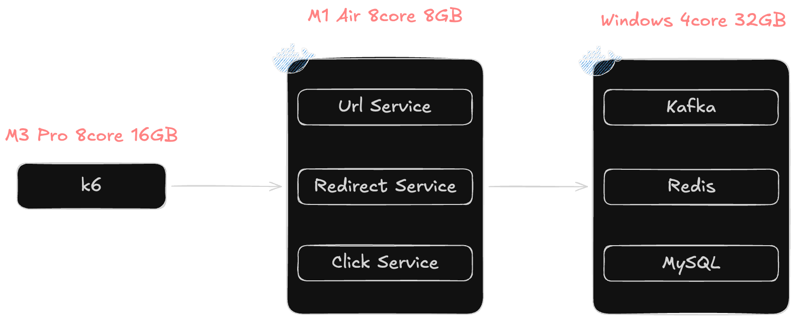

## 1. 테스트 환경



- `k6 부하 생성 서버`: 8core 16GB RAM
- `API Server`: 8core 8GB RAM
- `infrastructure`: 4core 32GB RAM

## 2. 테스트 개요

### 2.1 테스트 목적

- Read-Heavy 환경에서 리다이렉션 API의 성능 측정

### 2.2 부하 구성

| 단계    | 시간  | 사용자           |
|-------|-----|---------------|
| 워밍업   | 10초 | 0 → 30        |
| 부하 증가 | 20초 | 30 → 1,000    |
| 최대 부하 | 30초 | 1,000 → 1,500 |
| 부하 감소 | 10초 | 1,200 → 0     |

### 2.3 성공 기준

- 에러율 1% 미만
- P95 50ms 이하

## 3. 1차 개선

### 3.1 Baseline 측정
- TPS: 7365/s
- P95: 133.4ms
- P90: 118.66ms
- 타임아웃으로 62개 요청 누락
- 에러 메시지: `error="Get \"http://.../r/IxRq2mjYht\": dial: i/o timeout"`

상세 결과
```text
  █ TOTAL RESULTS

    checks_total.......: 765855 7360.353379/s
    checks_succeeded...: 99.99% 765793 out of 765855
    checks_failed......: 0.00%  62 out of 765855

    ✗ status is 302
      ↳  99% — ✓ 765793 / ✗ 62

    HTTP
    http_req_duration..............: avg=63.18ms min=0s     med=37.06ms max=2.31s  p(90)=118.66ms p(95)=133.4ms
      { expected_response:true }...: avg=63.19ms min=5.32ms med=37.07ms max=2.31s  p(90)=118.66ms p(95)=133.4ms
    http_req_failed................: 0.00%  62 out of 766355
    http_reqs......................: 766355 7365.158697/s

    EXECUTION
    iteration_duration.............: avg=66.3ms  min=5.42ms med=37.38ms max=25.91s p(90)=118.78ms p(95)=133.59ms
    iterations.....................: 765855 7360.353379/s
    vus............................: 14     min=0            max=1198
    vus_max........................: 1200   min=1200         max=1200

    NETWORK
    data_received..................: 95 MB  913 kB/s
    data_sent......................: 68 MB  649 kB/s

```

### 3.2 원인 분석

- 최대 부하 시점(사용자 1,500명)에 `tomcat_threads_current_threads`이 `max-connections(1,000)`에 도달
- 신규 연결 대기로 타임 아웃 발생
- Live Threads는 24개, Peak Threads는 26개로 Thread 리소스는 충분하다 판단

### 3.3 개선 작업

- 목표: 부하 피크 시 신규 연결이 거부되는 문제 해결
- 진행 작업:
  - accept-count: 300 -> 500
  - max-connections: 1,000 -> 1,500(최대 사용자와 동일)

### 3.4 개선 결과
- 요청 누락 및 TPS 개선
- P95, P90은 약 10ms 증가 -> 타임아웃이 아닌 대기 큐에서 대기하는 시간이 늘어나 악화된 것으로 추정
  - TPS: 10,505 (+3140, 42% 증가)
  - P95: 141.37ms (+8ms)
  - P90: 129.64ms (+11ms)

```text
  █ TOTAL RESULTS

    checks_total.......: 779734  10499.187321/s
    checks_succeeded...: 100.00% 779734 out of 779734
    checks_failed......: 0.00%   0 out of 779734

    ✓ status is 302

    HTTP
    http_req_duration..............: avg=63.08ms min=5.23ms med=36.43ms max=518.12ms p(90)=129.64ms p(95)=141.37ms
      { expected_response:true }...: avg=63.08ms min=5.23ms med=36.43ms max=518.12ms p(90)=129.64ms p(95)=141.37ms
    http_req_failed................: 0.00%  0 out of 780234
    http_reqs......................: 780234 10505.919866/s

    EXECUTION
    iteration_duration.............: avg=63.41ms min=5.32ms med=37.22ms max=518.17ms p(90)=129.84ms p(95)=141.7ms
    iterations.....................: 779734 10499.187321/s
    vus............................: 40     min=0           max=1197
    vus_max........................: 1200   min=1200        max=1200

    NETWORK
    data_received..................: 97 MB  1.3 MB/s
    data_sent......................: 69 MB  925 kB/s
```

## 4. 2차 개선

### 4.1 작업 목표
- P95 및 P90 개선


### 4.2 원인 분석
- Kafka 이벤트 발행의 병목
- 이유:
  - 리다이렉트 요청은 다음 과정으로 진행
    1. 캐시(L1, L2)에서 URL 조회
    2. 클릭 이벤트 발행
    3. URL 반환
  - 부하 테스트 특성상 L1 캐시에서 대부분 캐시 히트 발생
  - 테스트 시간별 L1 캐시 히트율
    - 1분: 100%
    - 30분: 91.8%
  - 이벤트 발행 코드 주석 후 동일 테스트를 진행하여 개선 효과 확인
    - P95:	148.02ms -> 68.78ms (-53%)
    - P90:	131.89ms -> 66.08ms (-50%)
    - TPS:	10,783/s -> 13,474/s (+25%)

### 4.3 개선 작업
- 목표: 이벤트 발행 작업을 메인 스레드에서 분리하여 응답 지연 제거
- 고려한 기술:
  - Redis Buffer
    - 구현 복잡도와 추가 인프라를 고려하면 오버엔지니어링이라고 판단
  - @Async
    - Spring retry와 DLQ 운영을 위한 실패 처리 로직 필요
  - `Executor + DLQ` (채택)
    - 재시도 + DLQ가 내장되어 있어 구현이 간단
    - 추가 인프라 설정 없이 사용 가능하여 복잡도 절감

### 4.4 개선 결과
- TPS 및 P95, P90은 개선됐지만 목표치에는 미달
  - P90	129.64ms ->	65.26ms	(-50%)
  - P95	141.37ms -> 67.84ms	(-54%)
  - TPS	10,505/s	-> 13,622/s	(+26%)

```text
  █ TOTAL RESULTS

    checks_total.......: 986216  13621.759113/s
    checks_succeeded...: 100.00% 986216 out of 986216
    checks_failed......: 0.00%   0 out of 986216

    ✓ status is 302

    HTTP
    http_req_duration..............: avg=49.52ms min=5.2ms  med=55.53ms max=584.77ms p(90)=65.26ms p(95)=67.84ms
      { expected_response:true }...: avg=49.52ms min=5.2ms  med=55.53ms max=584.77ms p(90)=65.26ms p(95)=67.84ms
    http_req_failed................: 0.00%  0 out of 986236
    http_reqs......................: 986236 13622.035356/s

    EXECUTION
    iteration_duration.............: avg=50.13ms min=5.25ms med=55.69ms max=584.8ms  p(90)=65.58ms p(95)=68.64ms
    iterations.....................: 986216 13621.759113/s
    vus............................: 56     min=0           max=1196
    vus_max........................: 1200   min=1200        max=1200

    NETWORK
    data_received..................: 121 MB 1.7 MB/s
    data_sent......................: 87 MB  1.2 MB/s
```
## 5. 3차 개선: 개선 사항 없음
### 5.1 애플리케이션은 이미 최적화 상태
#### 근거1: 요청 지연 시간 분포
- 전체 요청의 99.7%가 서버 내부에서 1ms 이내로 처리
  - 
#### 근거2: JVM 메트릭
- GC 횟수: 5.27번
  - 
- Stop The World 시간: 8ms
  - 
- JVM Heap 메모리 사용량: 74.4MB
  - 

### 5.2 P95, P90이 목표치에 미달되는 이유: WiFi
- k6 부하 서버와 WAS는 동일한 WiFi를 사용하여 네트워크 지연이 발생
- ping 테스트 결과:
  - Min: 6.4ms
    Avg: 39.2ms
    Max: 105.2ms
    Stddev: 35.6ms

## 6. 결과 요약

### 6.1 개선 전후 비교

| 지표 | Baseline | 1차 개선 | 2차 개선 | 개선율 |
|------|----------|----------|----------|--------|
| TPS | 7,365/s | 10,505/s | 13,622/s | +85% |
| P95 | 133.4ms | 141.37ms | 67.84ms | -49% |
| P90 | 118.66ms | 129.64ms | 65.26ms | -45% |
| 에러율 | 0.008% | 0% | 0% | -100% |

### 6.2 주요 개선 사항

| 단계 | 병목 | 해결책 |
|------|------|--------|
| 1차 | Tomcat 연결 제한 | max-connections 1,500으로 증가 |
| 2차 | Kafka 발행 블로킹 | Virtual Thread Executor로 분리 |
